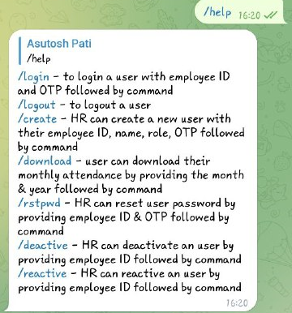

# TelegramAttendanceBot

TelegramAttendanceBot is a bot designed for small-scale businesses to automate their workforce attendance tracking, especially for remote or off-site workers. The bot provides functionalities for both HR (Human Resources) and Employees.

## Features

1. HR Functions:
   - Create and manage the organization's attendance system.
   - View and export attendance reports.
   - Add and remove employees.
   - Set up notifications and reminders. **(upcoming-feature)**

2. Employee Functions:
   - Clock-in and clock-out for work.
   - View personal attendance history.
   - Receive notifications and reminders. **(upcoming-feature)**

## Getting Started

To set up the TelegramAttendanceBot for the first time, follow these steps:

1. Clone the repository:
    ```bash
    git clone https://github.com/your-username/TelegramAttendanceBot.git
    ```
2. Create a `.env` file in the project directory or set the environment variables in your environment using the sample.env file provided.
   - SUPER_HR_EMP_ID: Employee ID of your HR 
   - SUPER_HR_NAME: Full name of your HR
   - SUPER_HR_PWD: A single time password for your HR **(If you forget password, it can be reset by other HRs or you have to start from the beginning)**
3. [Obtain a Bot Token from Telegram](https://core.telegram.org/bots/tutorial#introduction):
   - Go to the Telegram website or open the Telegram app.
   - Search for the BotFather bot.
   - Start a chat with BotFather and follow the instructions to create a new bot.
   - Once the bot is created, BotFather will provide you with a Bot Token.
   - Copy the Bot Token and save it for the next step.
4. Configure the Bot Token:
   - Open the `.env` file or environment variable and set the `BOT_TOKEN` variable to the Bot Token obtained from BotFather.
5. Launch the bot:
   - Run the following command in the project directory:
     ```bash
     python main.py
     ```

6. Start using the bot:
   - Open Telegram and search for your bot using the username created during the BotFather setup.
   - Start a chat with the bot by giving command `/start` or `/hello`.
   - Or you can directly login by giving command `/login` with your employee ID and One Time Password provided by your HR.
     ```bash
     /login
     <employee-ID>
     <One-Time-Password>
     ```
   - Login is required once, and you will be kept logged in until and unless you log out yourself or change your Telegram account.
   - For other commands you can visit help section by giving command `/help`.
   - For clock-in or clock-out, a user need to send his/her selfie followed by location with in 2 minutes to put the attendance, same for HR too.

Please note that the bot setup will create a super HR user who will have complete control over the organization's attendance system. Ensure that you keep the Bot Token and super HR credentials secure.

## Screenshots

 | You can start with `/start` or `/hello` command to begin interaction with the bot |
:-------------------------:|:-------------------------: |
You can take the help from bot at any time just by using `/help`; This will provide you the commands available and their uses |  |
 | An user(employee/HR) can login using `/login` command with employee ID and One Time Password provided by HR |
Similar to login process an user can also perform logout process just by sending the command `/logout` |  |
 | A HR can add new users(employee/HR) by sending `/create` command followed by employee ID, full name of user, role(employee/HR) and a new One Time Password |
A HR can also deactive any employee by providing command `/deactive` with the employee ID |  |
 | Similar to deactivation process HR can also reactivate any user by sending the command `/reactive` followed by the employee ID |
If an user has logged out or wants to login again with a new telegram account then a new One Time Password will be required to login; by `/rstpwd` command a new One Time Password can be set for the user by HR, providing the employee ID and a password |  |
 | Share a selfie (Use timestamp camera for accurate time & location) followed by location with in 2 minutes (delay can be set in settings.py) to add your attendance |
While sharing location, provide location access to Telegram app and tap on "**Send Selected Location**" |  |
 | Attendance Report can be downloaded by both HR and Employee. HR can can download all user attendance where as Employees can download only their own data. <br> use command `/download` to download the attendance report of the same day. <br> `/download` followed by DD MM YYYY for report of a specific date, MM YYYY for report of a specific month, YYYY for report of a specific year. <br> `/download` followed by date string and employee ID provide attendance report for a the specific user. |
 |  |


## Future Developments

- **Face Recognition Integration**: In the future, we plan to implement face recognition technology to enhance attendance verification and ensure accurate tracking of employees' clock-in and clock-out.
- **Geofencing Implementation**: We are working on incorporating geofencing capabilities to enable the tracking of employees' location during work hours, providing an additional layer of security and ensuring that employees are present at designated work locations.
- **HR Dashboard**: Our team is also developing a web-based dashboard specifically designed for HR and organizations to access comprehensive attendance data, generate detailed reports, and manage workforce attendance efficiently.

We are excited about these future developments and aim to continually improve the functionality and user experience of TelegramAttendanceBot. Stay tuned for updates and new features!

## Contribution

Contributions to the TelegramAttendanceBot project are welcome! If you encounter any issues, have suggestions, or would like to contribute to its development, please submit a pull request or open an issue on the GitHub repository.

## License

This project is licensed under the MIT License. Feel free to modify and use it according to your needs.

## Acknowledgements

- The TelegramAttendanceBot project was inspired by the need for remote attendance tracking in small-scale businesses.
- Thanks to the [Telegram](https://telegram.org/) [team](https://twitter.com/telegram) for providing the platform and [API](https://core.telegram.org/api) for building chatbots.
- Special thanks to all the contributors and supporters of this project.

We hope that TelegramAttendanceBot proves to be a useful tool for managing attendance and streamlining workforce tracking in your organization.
